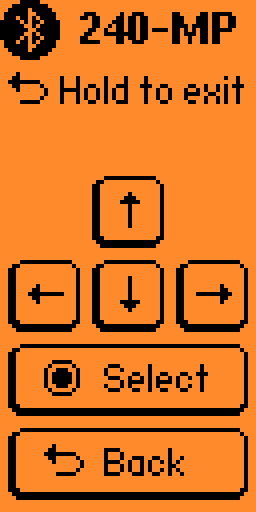

# 240-MP Remote

240-MP Remote is a standalone Flipper Zero Bluetooth controller for Anthony Caccese’s [240-MP](https://github.com/anthonycaccese/240-MP). It sends standard keyboard input over Bluetooth Low Energy, requiring no additional software or configuration on 240-MP hosts that support Bluetooth keyboards.

This is an independent, unofficial community project. It is not affiliated with or endorsed by Flipper Devices.

## Install

Download `mp_240_remote.fap` from the [latest release](https://github.com/snkinard/240-MP-Flipper-Remote/releases/latest). With the Flipper connected over USB, use qFlipper's file manager to copy it to `SD Card/apps/Bluetooth/`, then start **Apps > Bluetooth > 240-MP Remote** on the Flipper.

## Controls



- Directional buttons send the arrow keys.
- OK sends Return/Enter.
- A short Back press sends Escape; hold Back to exit.
- Pressed buttons are highlighted on the Flipper screen.

The UI is designed in the spirit of [Flipper's Keynote Vertical](https://lab.flipper.net/apps/hid_usb) app. Therefore, it is intended to be held vertically while in use.

## Build from source

These commands are supported on macOS and Linux and require `Bash`, `Python 3` with `pip`, `curl`, `Make`, and a C compiler available through the `cc` command. On macOS, install the `Xcode Command Line Tools`. Native Windows builds have not been tested.

The supported toolchain is `uFBT 0.2.6` with the official `Flipper firmware SDK 1.4.3` for firmware API `87.1` and target `f7`/hardware `7`. The setup target installs hash-locked Python packages and verifies the checksum-pinned SDK before use.

```sh
make setup
make test
make lint
make build
```

The FAP is written to `dist/mp_240_remote.fap`. To upload and launch this development build directly with uFBT, connect the Flipper over USB and run:

```sh
make launch
```

See the official [uFBT documentation](https://github.com/flipperdevices/flipperzero-ufbt) for general uFBT setup and troubleshooting.

## Pairing and host changes

1. Enable Bluetooth under **Settings > Bluetooth** on the Flipper.
2. Start **240-MP Remote**.
3. Pair the controller advertised by the app in the host's Bluetooth settings.

The app supports one active host at a time. Before moving to another host, exit the app and forget its controller on the current host. Reopen the app, hold OK, confirm the private bond reset, and pair the new host.

The app uses its own Bluetooth bond store. Resetting it does not erase the Flipper's normal Serial/mobile bond.

## Compatibility

240-MP Remote has been verified with:

- Official Flipper firmware `1.4.3` using firmware API `87.1` and target `7`.
- 240-MP `v2026.08.17`.
- Raspberry Pi OS on Raspberry Pi 3.
- Apple Silicon macOS.

Other firmware versions, 240-MP releases, and host platforms may work but have not been tested.

## Project information

- [Contributing](CONTRIBUTING.md)
- [Third-party notices](THIRD_PARTY_NOTICES.md)
- [GPL-3.0 license](LICENSE)
- [Bug reports and feature requests](https://github.com/snkinard/240-MP-Flipper-Remote/issues/new/choose)
